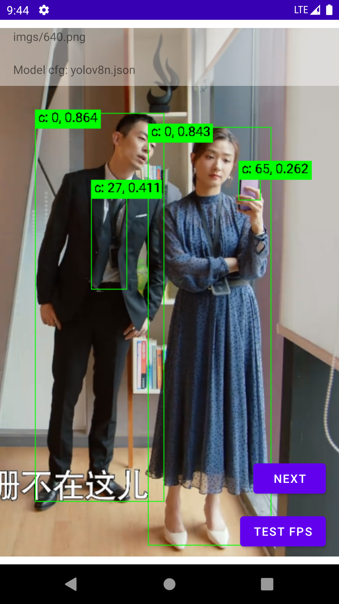

# A Android Library for YOLOv5/v7/v8 Detect/Pose Inference Based on [NCNN](https://github.com/Tencent/ncnn)
 Support [yolov5](https://github.com/ultralytics/yolov5),  [edgeai-yolov5](https://github.com/TexasInstruments/edgeai-yolov5/tree/yolo-pose),  [yolov7](https://github.com/WongKinYiu/yolov7),  [yolov8](https://github.com/ultralytics/ultralytics)

 System: Android 5.0+(21)

[中文](README_zh.md)

# How to

1 download the [.aar](https://github.com/wkt/YoloMobile/releases) file

2 put .aar file in app/libs directory

3 edit app/build.gradle
```
implementation files('libs/yolo_mobile_release_2023xxyyzz_V1.0r1.aar')
```

4 put ncnn .bin and .param into assets directory

5 create new named 'yolo_cfg.json'
```
{
  "name": "yolov8n",
  "input_size": 384,
  "param": "yolov.param",
  "bin": "yolo.bin",
  "box_thr": 0.5,
  "iou_thr": 0.5,
  "nkpt": 0, 
  "ver": 8,
  "outputs": [
    {"name": "345","stride":8,"anchors": [10,13, 16,30, 33,23]},
    {"name": "365","stride":16,"anchors": [30,61, 62,45, 59,119]},
    {"name": "385","stride":32,"anchors": [116,90, 156,198, 373,326]}
  ],
  
  "names": [ "person", "bicycle", "car", "motorcycle", "airplane", "bus", "train", "truck", "boat", "traffic light",
  "fire hydrant", "stop sign", "parking meter", "bench", "bird", "cat", "dog", "horse", "sheep", "cow",
  "elephant", "bear", "zebra", "giraffe", "backpack", "umbrella", "handbag", "tie", "suitcase", "frisbee",
  "skis", "snowboard", "sports ball", "kite", "baseball bat", "baseball glove", "skateboard", "surfboard",
  "tennis racket", "bottle", "wine glass", "cup", "fork", "knife", "spoon", "bowl", "banana", "apple",
  "sandwich", "orange", "broccoli", "carrot", "hot dog", "pizza", "donut", "cake", "chair", "couch",
  "potted plant", "bed", "dining table", "toilet", "tv", "laptop", "mouse", "remote", "keyboard", "cell phone",
  "microwave", "oven", "toaster", "sink", "refrigerator", "book", "clock", "vase", "scissors", "teddy bear",
  "hair drier", "toothbrush" ]

}
```
Key value:

  input_size -- input image size (must be w=h), for example: 640

  input_name -- input node name

  outputs    --- list of output node

Optional key value:

  ver     -- yolo v8 need set to 8

  names   -- class names

  nkpt    -- number of keypoint, for example(coco): 17


6 call the model
```

        infer = new YoloInfer(ctx);
        infer.loadFromConfigAssets("yolo_cfg.json");
        ...
        List<YoloInfer.Box> boxes = infer.detect(bitmap);
        ...
        YoloInfer.draw(canvas,boxes,paint);

```

# Proguard
```
-keep class com.weiketing.yolomobile.YoloInfer { *; }
```

# Demo
 Download demo [apk](https://github.com/wkt/YoloMobile/releases/download/v1.0.2r3/app-debug.apk)
 
 Screenshot:
 
 
# Rebuild .aar file
```
bash gradlew :YoloMobile:assembleRelease
```
